# Wafer Defect Annotation & Inspection

**End-to-end computer-vision pipeline** for detecting manufacturing defects on
optical / wafer-component images — built with **Codex CLI + MCP**, **Roboflow**,
and **Label Studio**.

| | |
|---|---|
| **Goal** | Detect scratches, solder voids, misalignment (and related defects), then route low-confidence cases to human review |
| **Roboflow project** | [`sarbani-datta/wafer-defect-annotation-inspection`](https://app.roboflow.com/sarbani-datta/wafer-defect-annotation-inspection) |
| **Model** | RF-DETR Medium · version `1` · model id `wafer-defect-annotation-inspection/1` |
| **Inspection workflow** | [`wafer-defect-inspection`](https://app.roboflow.com/sarbani-datta/workflows/wafer-defect-inspection) |
| **Label Studio** | Local project `wafer-defect-review` · http://localhost:8080 |
| **Dataset** | 4,531 images · **80 / 10 / 10** train / valid / test |
| **Doc updated** | 2026-08-31 |

### Working Roboflow links (use these)

| What you want | Open this |
|---|---|
| Project home | https://app.roboflow.com/sarbani-datta/wafer-defect-annotation-inspection |
| **Training / eval metrics (mAP, charts)** | https://app.roboflow.com/sarbani-datta/wafer-defect-annotation-inspection/1/train/results |
| Models list | https://app.roboflow.com/sarbani-datta/wafer-defect-annotation-inspection/models |
| Dataset version 1 | https://app.roboflow.com/sarbani-datta/wafer-defect-annotation-inspection/1 |
| Inspection workflow editor | https://app.roboflow.com/sarbani-datta/workflows/wafer-defect-inspection |

> Do **not** use `/evaluation/1` — that deep link often shows **Page not found** after a project rename. Use **Train results** or **Models** instead.

---

## Table of contents

1. [Executive summary](#1-executive-summary)
2. [End-to-end pipeline](#2-end-to-end-pipeline-how-it-works)
3. [Codex CLI + MCP](#3-how-codex-cli--mcp-are-used)
4. [Sample images & classes](#4-sample-inspection-images--defect-classes)
5. [Data annotation](#5-stage-a--data-annotation-roboflow--label-studio)
6. [Training](#6-stage-b--training)
7. [Model evaluation](#7-stage-c--model-evaluation)
8. [Inspection workflow](#8-stage-d--inspection-workflow)
9. [Improvement plan](#9-recommended-next-steps-model-improvement-plan)
10. [Setup](#10-setup-engineering)
11. [Repository layout](#11-repository-layout)
12. [Data handling & security](#12-data-handling--security)
13. [Quick links](#13-quick-links)

---

## 1. Executive summary

This repository automates the loop from **raw wafer images → labeled dataset →
trained detector → production-style inspection**. An AI coding agent (Codex CLI
or Cursor) drives Roboflow and Label Studio through **MCP** tools, so most steps
are done with natural-language prompts instead of hand-written API scripts.

**Current model (held-out test set):**

| Metric | Value |
|---|---|
| mAP@50 | **36.3%** |
| Precision | **52.1%** |
| Recall | **39.7%** |

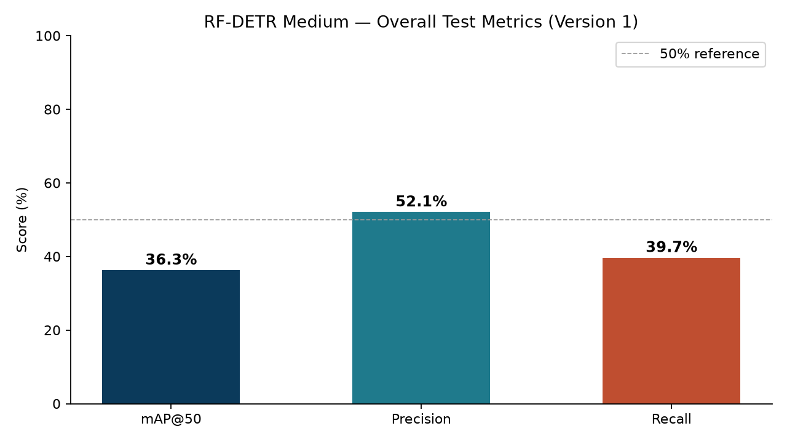

**Takeaway for leadership**

- The **full pipeline is operational** (annotate → train → inspect with human gate).
- Detection is a usable **first-pass filter** for **solder void** and **scratch**.
- **Misalignment is not reliable yet** (only ~53 labeled examples).
- Low-confidence predictions are routed to **`needs_review`**, so the line does
  not auto-accept weak detections.

---

## 2. End-to-end pipeline (how it works)

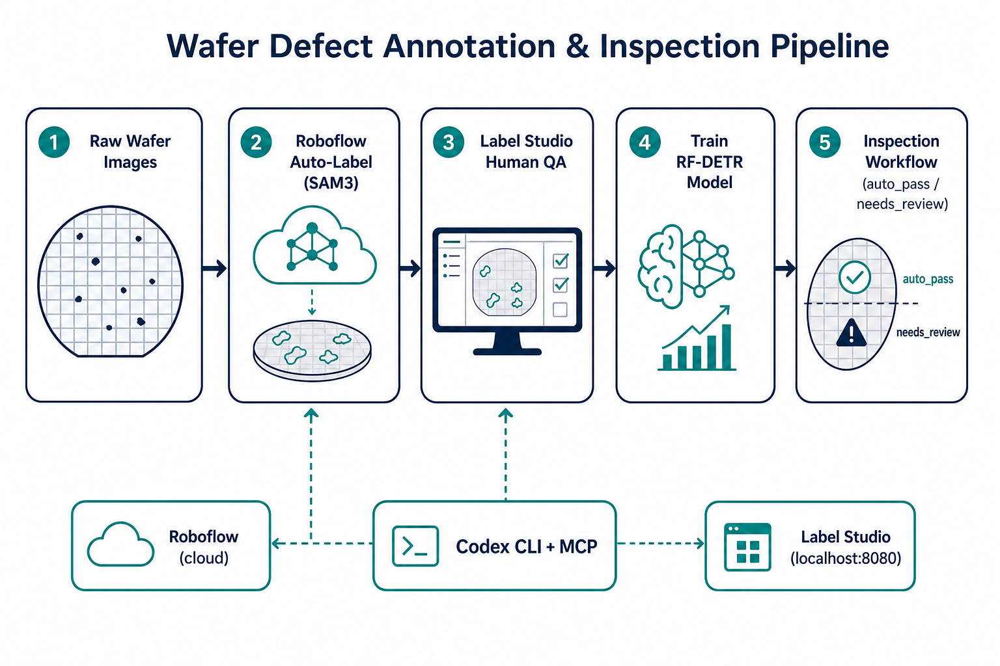

| Stage | What happens | Tool |
|---|---|---|
| **1. Ingest** | Raw inspection images land in `data/raw_images/` (gitignored) | Local filesystem |
| **2. Auto-label** | Foundation model (SAM3) proposes defect bounding boxes | Roboflow |
| **3. Human QA** | Reviewers correct / accept boxes in a browser UI | Label Studio (local) |
| **4. Dataset** | Corrected labels sync back; version generated 80/10/10 | Roboflow |
| **5. Train** | RF-DETR Medium trained on version 1 | Roboflow |
| **6. Inspect** | Workflow runs model; ≥90% conf → `auto_pass`, else `needs_review` | Roboflow Workflows |

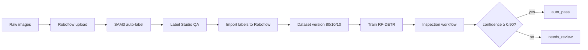

---

## 3. How Codex CLI + MCP are used

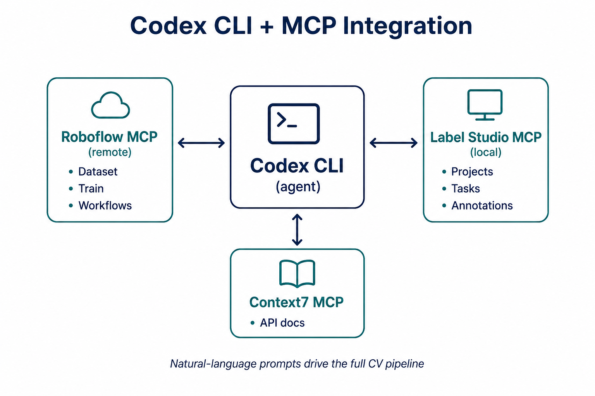

### What is MCP?

**MCP (Model Context Protocol)** lets the coding agent call *tools* on external
systems the same way a human would use a UI — create projects, upload images,
start training, list Label Studio tasks, publish workflows, etc.

Configured in `.codex/config.toml`:

| MCP server | Where it runs | Role in this project |
|---|---|---|
| **Roboflow** | Hosted remote endpoint | Dataset, auto-label, train, eval, workflows |
| **Label Studio** | Local (`localhost:8080`) via `uv` | Human annotation / QA |
| **Context7** | Remote docs lookup | Optional library/API docs while coding |

Roboflow is registered with `--url` (remote). Label Studio runs locally so
**raw component images stay on your machine** during review.

### Why this matters operationally

- Engineers describe *intent* in prompts (`prompts/01_…` → `04_…`); the agent
  executes Roboflow / Label Studio steps.
- New image batches can reuse the same four-step prompt sequence.
- Roboflow holds versions, metrics, and workflow endpoints; Label Studio holds
  human-reviewed ground truth.

### Typical agent session

1. Start Label Studio: `label-studio start --port 8080`
2. Open this folder in Codex or Cursor (with MCP servers enabled)
3. Paste the step prompt from `prompts/`
4. Approve MCP tool calls as the agent creates projects, uploads, trains, etc.

---

## 4. Sample inspection images & defect classes

Examples of the optical-component imagery used for labeling and training
(from the local COCO export under `data/annotated/`):

| Sample A | Sample B | Sample C |
|---|---|---|
| 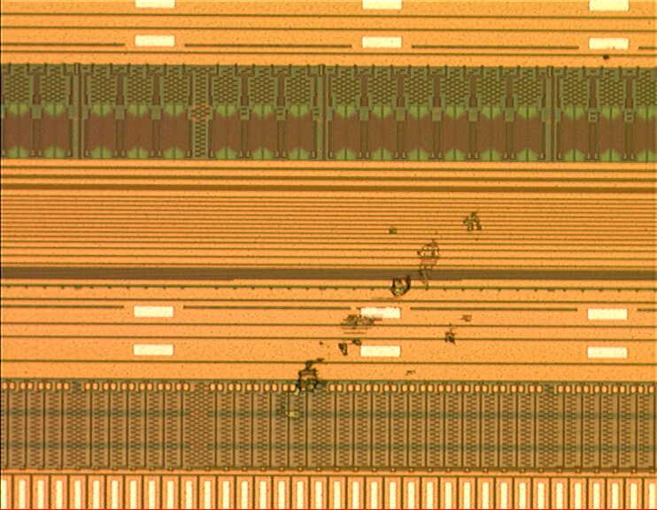 | 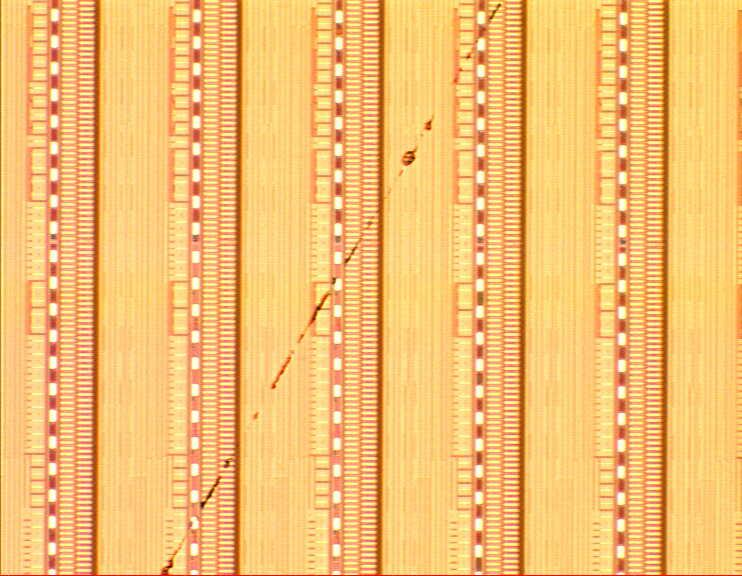 | 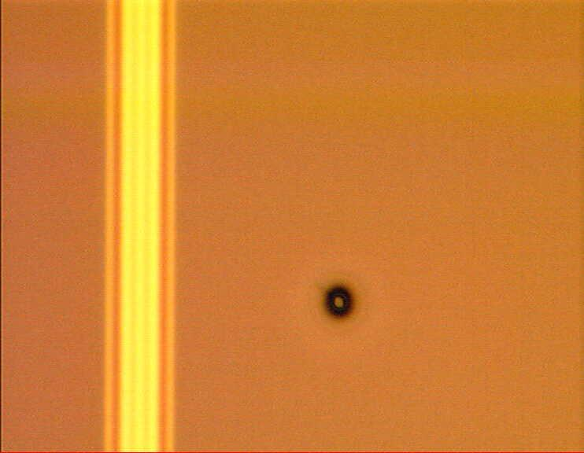 |

| Class | Meaning (manufacturing) | Status in v1 model |
|---|---|---|
| `scratch` | Surface scratch / line defect | Trained · mid performance |
| `solder void` | Void / missing solder region | Trained · strongest class |
| `misalignment` | Placement / alignment error | Trained · **too few examples** |
| `contamination` | Foreign residue / particle | In label config; scarce in train set |
| `chip-crack` | Crack on die / chip edge | In label config; scarce in train set |

---

## 5. Stage A — Data annotation (Roboflow → Label Studio)

### 5.1 Auto-label on Roboflow

1. Create object-detection project `wafer-defect-annotation-inspection`
2. Upload images (zip / batch)
3. Run foundation-model auto-label (SAM3) to propose boxes
4. Export / convert for Label Studio review

Prompt: `prompts/01_setup_project.md`

### 5.2 Human QA in Label Studio

Label Studio runs **locally**. Images are served from disk via
`LABEL_STUDIO_LOCAL_FILES_*` in `.env` (not public `file://` URLs).

1. Project: **`wafer-defect-review`**
2. Labeling config: bounding boxes for the defect classes above
3. Tasks imported with Roboflow auto-labels as starting annotations
4. Reviewers correct boxes  
   (~1,453 of 4,531 images had non-empty boxes after auto-label; many early
   queue tasks were empty)

Prompt: `prompts/02_annotate.md`

| Script | Purpose |
|---|---|
| `scripts/fix_label_studio_image_urls.py` | Rewrite task paths to `/data/local-files/…` so browsers load local media |
| `scripts/predictions_to_annotations.py` | Promote predictions into editable annotations |
| `scripts/import_ls_to_roboflow.py` | Push reviewed VOC XML annotations back into Roboflow |

### 5.3 Annotation → dataset sync

Reviewed annotations were uploaded to Roboflow, accepted into the **Dataset**,
then rebalanced to **80% / 10% / 10%**:

| Split | Images |
|---|---|
| Train | 3,625 |
| Valid | 453 |
| Test | 453 |
| **Total** | **4,531** |

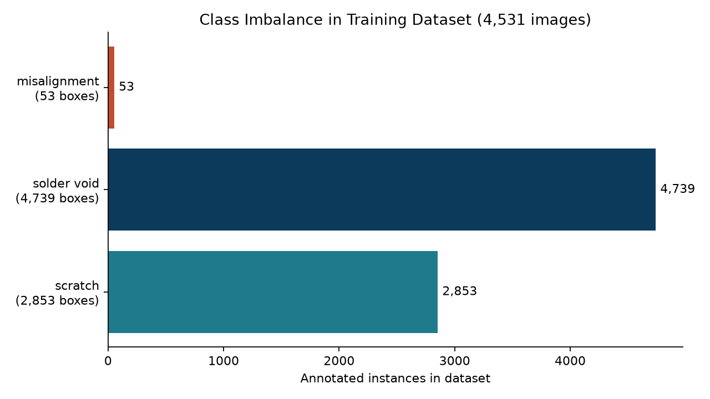

**Class imbalance is the #1 data risk:** misalignment has only **53** instances
vs thousands for solder void / scratch. Rare classes will stay weak until more
examples are labeled.

---

## 6. Stage B — Training

Prompt: `prompts/03_train.md`

| Setting | Choice |
|---|---|
| Architecture | **RF-DETR Medium** (strong default for small surface defects) |
| Dataset version | `1` (`2026-08-28`) |
| Split | 80 / 10 / 10 |
| Model API id | `wafer-defect-annotation-inspection/1` |

Training ran on Roboflow-managed compute (no local GPU required for this run).

**Open metrics in the app:**  
https://app.roboflow.com/sarbani-datta/wafer-defect-annotation-inspection/1/train/results

**UI path if the link ever fails:** Project → **Versions** → version **1** →
**Train** / **Results** (or sidebar **Models** → RF-DETR run).

---

## 7. Stage C — Model evaluation

### 7.1 Overall test metrics

| Metric | Test |
|---|---|
| **mAP@50** | **36.3%** |
| **Precision** | **52.1%** |
| **Recall** | **39.7%** |


**How to read this**

- **Precision ~52%** — about half of predicted boxes are correct (false
  positives still common, especially scratches).
- **Recall ~40%** — many true defects are still missed (false negatives).
- In manufacturing, **missed defects (low recall)** are usually more costly
  than extra human review of false positives — which is why inspection uses a
  **low detect threshold + high auto-pass bar** (Stage D).

### 7.2 Per-class performance (test)

| Class | Precision | Recall | F1 | mAP@50 | Notes |
|---|---|---|---|---|---|
| **solder void** | 56.9% | 42.9% | 48.9% | 39.9% | Strongest class |
| **scratch** | 42.7% | 39.6% | 41.1% | 32.6% | Mid; many FPs at low confidence |
| **misalignment** | 0% | 0% | 0% | — | Effectively not learned (n≈53) |

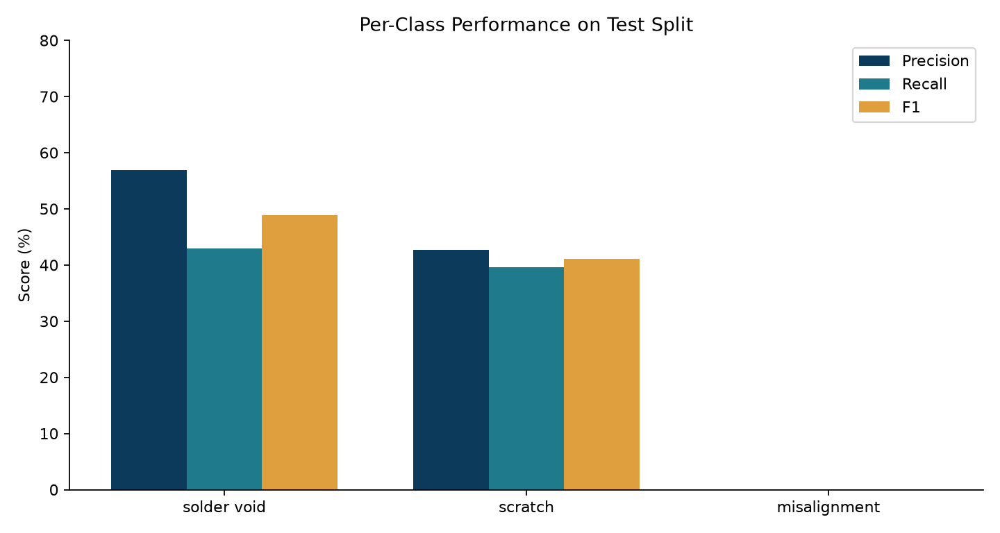

### 7.3 Performance by defect size

| Object size | Test mAP@50 |
|---|---|
| Small | 17.3% |
| Medium | 46.2% |
| Large | 57.7% |

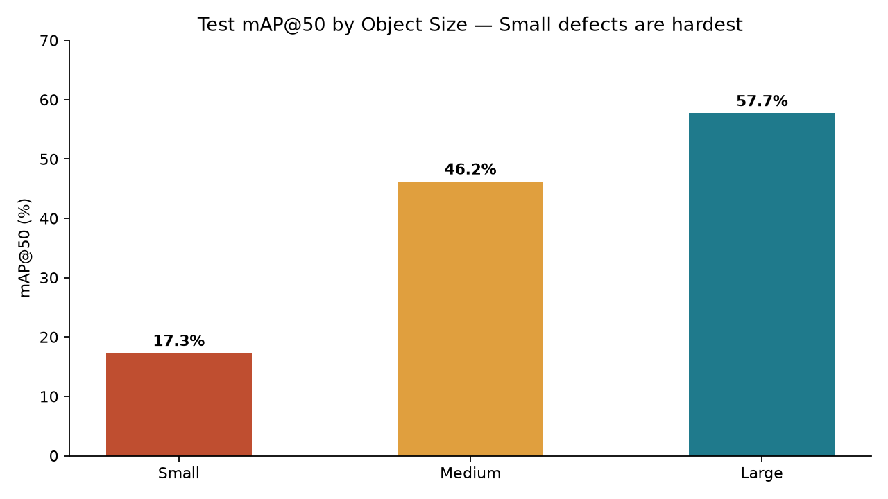

Small defects are the hardest (typical for surface inspection).

### 7.4 Confusion matrix (test, confidence ≥ 0.20)

Rows = ground truth · Columns = model prediction.

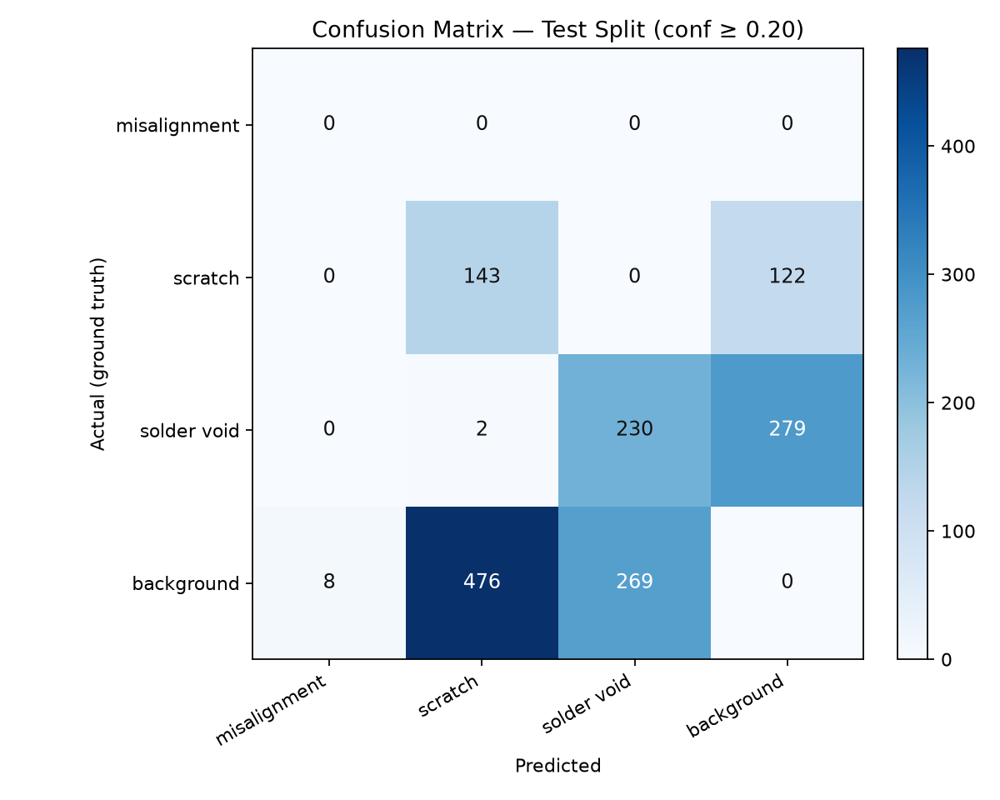

- Many **solder void** / **scratch** instances predicted as **background**
  (missed detections) → lower recall.
- High **background → scratch / solder void** counts → false positives that the
  90% auto-pass gate sends to human review.
- **Misalignment** barely appears in predictions.

### 7.5 Model-improvement recommendations (from Roboflow eval)

Auto-generated on the evaluation job (summary F1 ≈ 0.45 at ~33% confidence):

| Type | Finding | Implication |
|---|---|---|
| **Missed detection** | ~307 missed **solder void** | Need more varied examples; keep review gate |
| **Overconfident FP** | **scratch** ~140 FP / 105 TP near 33% conf | Tighten scratch guidelines; class-specific thresholds |
| **Wrong class** | Rare solder void ↔ scratch confusion | Minor; keep classes visually distinct |
| **Dataset health** | Valid split 10% (453 images) | OK for v1; grow rare classes next |

---

## 8. Stage D — Inspection workflow

Prompt: `prompts/04_inference_review.md`

| | |
|---|---|
| **Name / URL slug** | `wafer-defect-inspection` |
| **Editor** | https://app.roboflow.com/sarbani-datta/workflows/wafer-defect-inspection |
| **Serverless endpoint** | `POST https://serverless.roboflow.com/sarbani-datta/workflows/wafer-defect-inspection` |

### Behavior

1. Run detector `wafer-defect-annotation-inspection/1` at **low** confidence
   (`0.05`) so weak defects are not dropped early.
2. Split predictions:
   - confidence **≥ 0.90** → `auto_pass`
   - confidence **&lt; 0.90** → `needs_review`
3. Emit `status`: `auto_pass` or `needs_review`

### Example call

```bash
curl -X POST \
  "https://serverless.roboflow.com/sarbani-datta/workflows/wafer-defect-inspection" \
  -H "Content-Type: application/json" \
  -d "{\"api_key\": \"$ROBOFLOW_API_KEY\", \"inputs\": {\"image\": {\"type\": \"url\", \"value\": \"https://example.com/wafer.jpg\"}}}"
```

Base64 image payloads are also supported (see Roboflow Workflows docs).

**Production note:** if images cannot leave company infrastructure, run the same
workflow via **self-hosted Roboflow Inference** instead of the serverless URL.

---

## 9. Recommended next steps (model improvement plan)

1. **Label more misalignment (and contamination / chip-crack)** — target
   ≥200–300 instances per rare class before expecting non-zero test metrics.
2. **Hard-example mining from `needs_review`** — send rejects back to Label
   Studio → next Roboflow dataset version.
3. **Tighten scratch labeling guidelines** — reduce false-positive rate.
4. **Class-specific confidence thresholds** in the workflow (e.g. stricter
   auto-pass for scratch than solder void).
5. **Augment for small defects** — scale jitter / crops; small-object mAP@50 is
   only ~17%.
6. **Optional architecture trial** — keep RF-DETR as accuracy baseline; trial
   YOLO only if edge latency becomes the constraint.

---

## 10. Setup (engineering)

1. **Install**
   ```bash
   pip install label-studio uv
   npm install -g @openai/codex   # or use Cursor with MCP configured
   ```

2. **Start Label Studio**
   ```bash
   label-studio start --port 8080
   ```

3. **Configure secrets**
   ```bash
   cp .env.example .env
   # LABEL_STUDIO_API_KEY, ROBOFLOW_API_KEY
   # LABEL_STUDIO_LOCAL_FILES_SERVING_ENABLED=true
   # LABEL_STUDIO_LOCAL_FILES_DOCUMENT_ROOT=<path-to-repo>/data/annotated
   ```

4. **Launch the agent from this folder** so `.codex/config.toml` MCP servers load.

5. **Authenticate Roboflow** (OAuth or API key in MCP / `.env`).

6. **Smoke-check MCP**
   ```bash
   bash scripts/check_mcp_connection.sh
   ```

7. Run prompts in order: `01` → `02` → `03` → `04`.

### Why not `npx` for Roboflow?

Many Codex + MCP tutorials launch servers with `npx`. Roboflow’s MCP is a
**hosted URL**, not an npm package — register it with `--url`. Label Studio’s
MCP runs locally so it can reach your private Label Studio instance.

---

## 11. Repository layout

```
wafer-defect-annotation-inspection/
├── .codex/config.toml       # MCP: Roboflow + Label Studio + Context7
├── data/
│   ├── raw_images/          # drop new images here (gitignored)
│   └── annotated/           # COCO / Label Studio exports (gitignored)
├── docs/images/             # README figures (metrics + diagrams)
├── prompts/                 # step prompts 01–04
├── scripts/
│   ├── check_mcp_connection.sh
│   ├── fix_label_studio_image_urls.py
│   ├── predictions_to_annotations.py
│   ├── import_ls_to_roboflow.py
│   └── generate_readme_charts.py
├── .env.example
└── README.md
```

Regenerate metric charts after a new eval:

```bash
python scripts/generate_readme_charts.py
```

---

## 12. Data handling & security

- `data/raw_images/` and large annotated media are **gitignored** — do not commit
  proprietary wafer imagery.
- Label Studio review is **local**; only upload to Roboflow what security policy
  allows.
- If export-control or NDA applies, prefer **self-hosted inference** for Stage D
  and confirm cloud upload rules with IT before large transfers.

---

## 13. Quick links

| Resource | URL |
|---|---|
| Roboflow project | https://app.roboflow.com/sarbani-datta/wafer-defect-annotation-inspection |
| **Training / eval results** | https://app.roboflow.com/sarbani-datta/wafer-defect-annotation-inspection/1/train/results |
| Models | https://app.roboflow.com/sarbani-datta/wafer-defect-annotation-inspection/models |
| Inspection workflow | https://app.roboflow.com/sarbani-datta/workflows/wafer-defect-inspection |
| Label Studio (local) | http://localhost:8080 |
